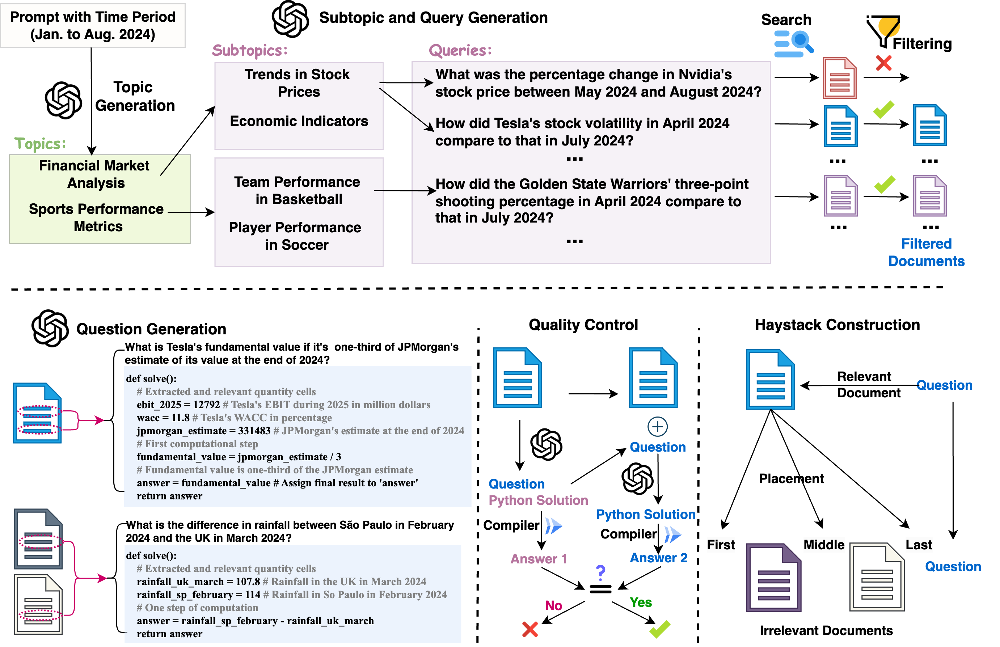
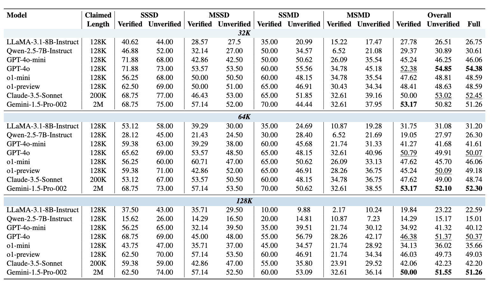
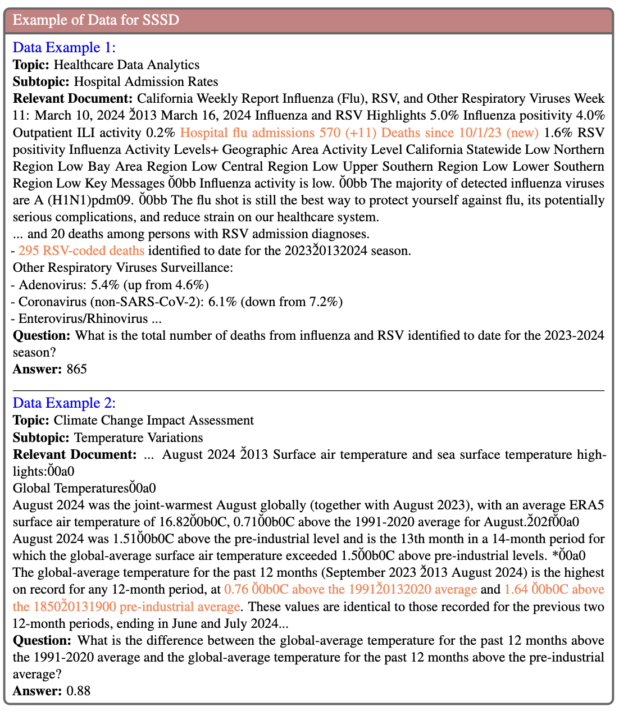

# MathHay: An Automated Benchmark for Long-Context Mathematical Reasoning in LLMs.

Data and code for our paper [An Automated Benchmark for Long-Context Mathematical Reasoning in LLMs](https://arxiv.org/abs/2410.04698).

For more details, please refer to the project page: https://mathhay.github.io/.

[[Webpage](https://mathhay.github.io/)] [[Paper](https://arxiv.org/abs/2410.04698)] [[Huggingface Dataset]()] [[Leaderboard]()] [[Twitter]()]

<!-- :star: Our data and method have inspired or been used for the development of recent large language models (LLMs) including [Google's Gemini](https://gemini.google.com), [Perplexity.AI's Online LLMs](https://blog.perplexity.ai/blog/introducing-pplx-online-llms), [You.com](https://about.you.com/introducing-the-you-api-web-scale-search-for-llms), and [Contextual AI's RAG 2.0](https://contextual.ai/introducing-rag2) :star: -->


## 💥 News 💥
- **[2024.11.14]** Our code is now accessible.
- **[2024.10.07]** Our paper is now accessible at https://arxiv.org/abs/2410.04698.


### Overview of the automatic construction of MATHHAY:
<p align="center">
     <br>
  Overview of the framework for the automatic construction of the <b>MATHHAY</b> Benchmark.
</p>

### Compared to existing long-context benchmarks:

| Benchmark            | Multi-Doc | Multi-Step | Avoid Contam. | Irrelevant Docs | Realistic Docs | Auto. Const. | Math. Reasoning |
|----------------------|-----------|------------|---------------|-----------------|----------------|--------------|-----------------|
| ZeroSCROLLS          | ✓         | ✓          | ✗             | ✓               | ✓              | ✗            | ✗               |
| L-Eval (Math)        | ✓         | ✓          | ✓             | ✗               | ✗              | ✓            | ✓               |
| LongBench            | ✓         | ✓          | ✓             | ✓               | ✓              | ✗            | ✗               |
| BAMBOO               | ✓         | ✗          | ✓             | ✓               | ✓              | ✗            | ✗               |
| InfiniteBench (Math) | ✓         | ✓          | ✗             | ✓               | ✗              | ✗            | ✓               |
| Loong                | ✓         | ✓          | ✓             | ✓               | ✓              | ✗            | ✗               |
| NIAH                 | ✗         | ✗          | ✗             | ✓               | ✓              | ✓            | ✗               |
| RULER                | ✓         | ✓          | ✗             | ✓               | ✓              | ✓            | ✗               |
| FlenQA               | ✗         | ✓          | ✗             | ✓               | ✓              | ✗            | ✗               |
| SummHay              | ✓         | ✗          | ✓             | ✓               | ✓              | ✗            | ✗               |
| BABILong             | ✓         | ✓          | ✓             | ✓               | ✓              | ✗            | ✗               |
| NeedleBench          | ✓         | ✓          | ✗             | ✓               | ✓              | ✓            | ✗               |
| **MathHay (Ours)**   | ✓         | ✓          | ✓             | ✓               | ✓              | ✓            | ✓               |


### Leaderboard on the MathHay V1:

Accuracy scores on the **MathHay** V1:

<p align="center">
     <br>
  Performance of Selected Models on <b>MATHHAY</b> (32K to 128K tokens). The model with the best performance is highlighted in bold.
</p>

### Dataset Examples

<p align="center">
     <br>
  Examples of the single step single document tasks.
</p>

## 🔮 Automatic Generation for MathHay

Run the following commands to install dependencies:
```sh
pip install openai
pip install pydantic
pip install tavily-python
pip install spacy
pip install pandas
pip install langchain
pip install langchain-core
pip install nltk
pip install tiktoken
pip install google
pip install boto3

python -m spacy download en_core_web_sm
```

Set up environment variables:
```sh
export TAVILY_API_KEY=""
export OPENAI_API_KEY=""
export PYTHONPATH="."
```

To generate MathHay data, use:
```sh
sh scripts/bench_generation.sh March-2024-to-September-2024 2 2 2
```
where assigned input arguments are time, number of topics, number of subtopics, and number of queries.

## 🔮 Evaluations on MathVista

Run the evaluation command:
```sh
sh scripts/evaluation.sh March-2024-to-September-2024 sssd gpt-4o 32000 middle full
```
where assigned input arguments are time, task type, models to be evaluated, input length, placement, and dataset choice.


## Citation


If you use our data or method, please cite our paper:
```bibtex
@article{wang2024mathhay,
  title={MathHay: An Automated Benchmark for Long-Context Mathematical Reasoning in LLMs},
  author={Wang, Lei and Dong, Shan and Xu, Yuhui and Dong, Hanze and Wang, Yalu and Saha, Amrita and Lim, Ee-Peng and Xiong, Caiming and Sahoo, Doyen},
  journal={arXiv preprint arXiv:2410.04698},
  year={2024}
}
```

